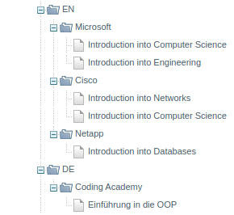

## Shopware5 category importer

This is a category importing console application built using PHP and Symfony/Console. 

It utilizes the [Shopware 5 category REST API](https://developers.shopware.com/developers-guide/rest-api/api-resource-categories/) 


### Technologies
- PHP > 7.0
- Symfony/Console

### Installation
* Clone this repo [here](https://github.com/agebeyaw/etribe-category-import-shopware5).
* cd `etribe-category-import-shopware5`
* Run `composer install`

### Configure
* Run `cp .env-dist .env`
* Edit your .env file to point to your Shopware5 instance API

Note: It is assumed that the instance already have the main categories associated to the two language shops.
  
### Using the app

Starting importing the categories from the sample json data.
You can optionally specify a different source using the `--source` option.

```sh
php console etribe:import-categories
php console etribe:import-categories --source=./data/categories-sample.json
```

Output
```
Working on language shop en...
        Created product line category Microsoft with id 87
                Successfully create title category Introduction into Computer Science with id 88
                Successfully create title category Introduction into Engineering with id 89
        Created product line category Cisco with id 90
                Successfully create title category Introduction into Networks with id 91
                Successfully create title category Introduction into Computer Science with id 92
        Created product line category Netapp with id 93
                Successfully create title category Introduction into Databases with id 94
Working on language shop de...
        Created product line category Coding Academy with id 95
                Successfully create title category Einführung in die OOP with id 96
```

Categories will results in shopware5 backend:



#### Questions
e-mail me at: [antenehgeb@gmail.com](mailto:antenehgeb@gmail.com)
